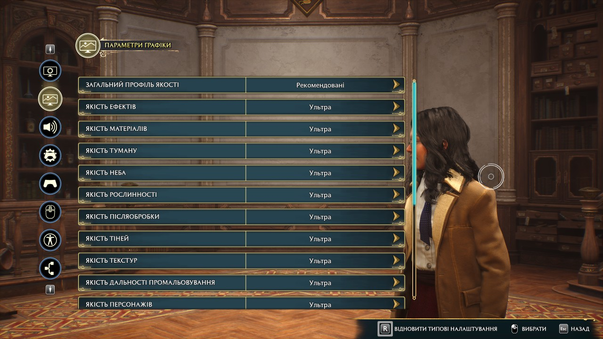
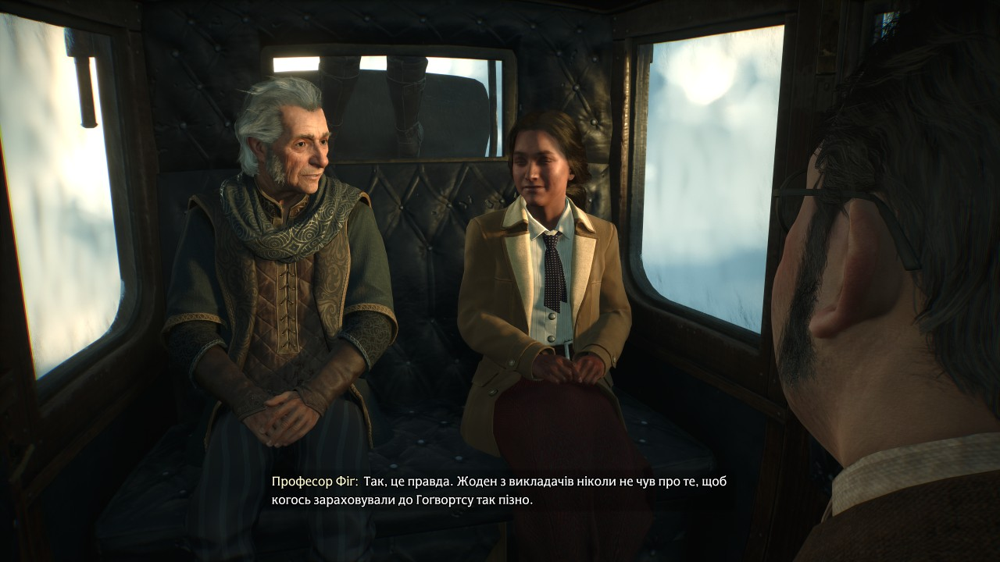

# Hogwarts Legacy українською

Неофіційна українська текстова локалізація Hogwarts Legacy для ПК (Windows).

## Швидкі посилання

- **[Завантажити українізатор — ZIP](https://github.com/fenrir-live/hogwarts-legacy-ukrainian/releases/download/v0.9.0-beta/Hogwarts-Legacy-UA-0.9.0-beta.zip)**
- **[Відкрити сторінку випуску](https://github.com/fenrir-live/hogwarts-legacy-ukrainian/releases/tag/v0.9.0-beta)**
- **[Повідомити про помилку](https://github.com/fenrir-live/hogwarts-legacy-ukrainian/issues/new?template=translation.md)**

Нижче — покрокові інструкції завантаження, встановлення та надсилання відгуку.

Перекладаємо з англійського оригіналу, з увагою до контексту, характерів персонажів і природної української мови. У роботі використовуємо локальну мовну модель та редакторську перевірку. Озвучення залишається оригінальним.

## Як це виглядає у грі

Параметри графіки українською.

Українські субтитри в початковій сцені — розмова з професором Фіґом у кареті.

Скриншоти тестового випуску 0.9.0-beta. Озвучення залишається оригінальним.

## Стан проєкту

**0.9.0-beta — випуск для тестування.** Пак містить переклад інтерфейсу, завдань, описів, записок і субтитрів. Структурна перевірка не замінює проходження гри: можливі неточності, проблеми узгодження роду, контексту та відображення тексту. Будемо вдячні за повідомлення про них.

## Завантаження

Обліковий запис GitHub для завантаження не потрібен.

1. Відкрийте [сторінку випусків](https://github.com/fenrir-live/hogwarts-legacy-ukrainian/releases).
2. Виберіть найновіший випуск локалізації. Позначка **Pre-release** означає тестову версію.
3. Унизу опису знайдіть **Assets** (файли випуску). Якщо список згорнутий, натисніть на цей напис.
4. Натисніть **Hogwarts-Legacy-UA-0.9.0-beta.zip**. У наступних випусках номер версії в назві змінюватиметься.
5. Дочекайтеся завершення завантаження. Зазвичай архів буде в папці **Завантаження** на вашому ПК.
6. Натисніть на ZIP правою кнопкою миші → **Видобути все…** / **Розпакувати все…**. Усередині буде `UKRAINIAN_TRANSLATION.pak` та ця інструкція.
7. Виконайте кроки розділу «Встановлення» нижче.

**Не натискайте Code → Download ZIP і не завантажуйте Source code (zip/tar.gz): ці архіви містять документацію, а не ігровий пак.**

## Встановлення

1. Закрийте гру.
2. Розпакуйте завантажений ZIP.
3. Відкрийте каталог установленої гри, а в ньому `Phoenix\Content\Paks`.
4. Створіть підкаталог `~mods`, якщо його ще немає.
5. Скопіюйте туди `UKRAINIAN_TRANSLATION.pak`.
6. Виберіть англійську мову тексту гри та запустіть гру.

Підсумковий шлях: `HogwartsLegacy\Phoenix\Content\Paks\~mods\UKRAINIAN_TRANSLATION.pak`.

Перед установленням приберіть із каталогу модів інші українізатори або моди, що замінюють ті самі тексти, зберігши їхні резервні копії поза каталогом гри. Не видаляйте інші моди навмання.

## Оновлення та видалення

Для оновлення закрийте гру та замініть попередній `UKRAINIAN_TRANSLATION.pak` новим. Не залишайте кілька версій локалізації одночасно.

Для видалення закрийте гру та видаліть лише `UKRAINIAN_TRANSLATION.pak`. Збереження гри видаляти не потрібно.

## Якщо щось не працює

- Перевірте шлях установлення, мову тексту та відсутність конфліктних локалізацій.
- Після оновлення гри сумісність може потребувати повторної перевірки.
- Підтримку консолей та інших операційних систем не перевірено.
- Побачили англійський текст, технічний ключ або невдале речення? Створіть звернення в **Issues**, додайте скриншот, версію пака та контекст сцени.
- Не публікуйте паролі, токени або особисті дані зі збережень.

## Зворотний зв’язок

Для мовної помилки важливі не лише слова, а й ситуація: хто говорить, до кого, стать персонажа, назва завдання та попередня репліка. Пропозиції виправлень вітаються. Перелік змін — у [CHANGELOG.md](CHANGELOG.md).

### Як повідомити про помилку

Для надсилання звернення потрібен безкоштовний обліковий запис GitHub. Якщо його немає, зареєструйтеся кнопкою **Sign up**, а потім увійдіть кнопкою **Sign in**.

1. Відкрийте [зворотну форму — Issues](https://github.com/fenrir-live/hogwarts-legacy-ukrainian/issues).
2. Спочатку перегляньте наявні звернення: можливо, цю помилку вже повідомили. Тоді додайте свій контекст коментарем до відповідного звернення.
3. Якщо такого звернення немає, натисніть **New issue** → **Помилка локалізації** (за потреби **Get started**).
4. У полі заголовка коротко напишіть суть, наприклад: «Неправильний рід у репліці професора Фіґа».
5. Заповніть запропоновані розділи: версію пака, місце помилки, поточний текст, контекст і встановлені моди. Якщо не знаєте версію гри, так і напишіть — це не заважає надіслати звернення.
6. Додайте скриншот: перетягніть зображення в поле опису або натисніть кнопку прикріплення файлів під ним. Дочекайтеся завершення завантаження зображення.
7. Власний варіант перекладу вітається, але не обов’язковий. Достатньо показати, де й що звучить неправильно.
8. Натисніть **Submit new issue** / **Create**, щоб надіслати звернення. Після цього воно має з’явитися в списку Issues.

Ми зможемо обговорити виправлення в коментарях до звернення. Перевіряйте його сторінку або сповіщення GitHub. Не пов’язані між собою помилки краще надсилати окремими зверненнями. Перед публікацією скриншота переконайтеся, що на ньому немає приватних даних.

## Про проєкт

Це фанатський проєкт, не пов’язаний з офіційними розробниками та видавцем. Для використання потрібна власна копія гри. Назви, персонажі та інші елементи Hogwarts Legacy належать відповідним правовласникам. Репозиторій не містить самої гри, озвучення, моделей чи приватних робочих даних.
